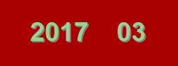

# *Drink* du 30 mars 2017

| pour tout savoir : |
| :--- |
| même sans compte *Facebook* / "*Twitter*" il y a les [***posts* de "*Brabançonne-Contact*"**](https://brab80webscom.github.io/facebookfeeds/) |

---

 

 

Nouvelle formule destinée à renforcer les liens entre occupants, et à favoriser la circulation de l'information, voici le ` PDO ` de la réunion informelle de mars 2017.

Quelques mots d'explication à propos des rubriques que vous retrouverez de mois en mois.

<b>Tout d'abord, qu'est-ce qu'un  ?</b>

	PDO = Portail Documentaire des Occupants

Un PDO, c'est l'occasion pour celles et ceux qui n'ont pas pu participer à l'une de nos réunions informelles régulières (en général, mensuelles) de se faire une idée de ce qui a été partagé.

C'est aussi un outil pour suivre dans le temps les points d'attention qui ont été portés à la connaissance des membres du conseil de copropriété. Celui-ci comporte souvent un ordre du jour chargé, et il n'est, dans la pratique, pas réaliste de considérer qu'une seule discussion en conseil de copropriété puisse suffire pour résoudre une difficulté ou achever de mettre en chantier des projets.

De *Drink* en *Drink*, nous reviendrons donc pour faire le point sur l'état d'avancement des dossiers dont nous aurons parlé, ou demandé de parler, précédemment.

En cas de sujet nouveau, nous lui attribuerons le label

 , ce qui signifiera qu'il doit encore être "travaillé" ; c'est-à-dire faire l'objet d'au moins une autre discussion en *Drink*  
  si, après une discussion, ce sujet semble déjà suffisamment mûr que pour être porté au niveau du conseil de copropriété

Si le sujet est trop complexe que pour être résolu par le conseil de copropriété, il pourrait par contre faire, le moment venu (avant le &cong; 7 février), l'objet d'une demande de point à l'ordre du jour d'une Assemblée Générale, nous lui attribuerons le label

  tant que le point sera en cours de rédaction  
  lorsque le point aura effectivement été introduit par un copropriétaire auprès du Syndic

Enfin, si le sujet ne dépend, ni du conseil de copropriété, ni de l'Assemblée Générale, nous utiliserons le label

  - typiquement, il s'agira de questions qu'une publication dans "Brabançonne-Contact" ou qu'une information relayée auprès des occupants pourra traiter  
 à nouveau, la case sera cochée dans le PDO lorsque l'information aura été diffusée

<b>Votre  2017-03</b>

